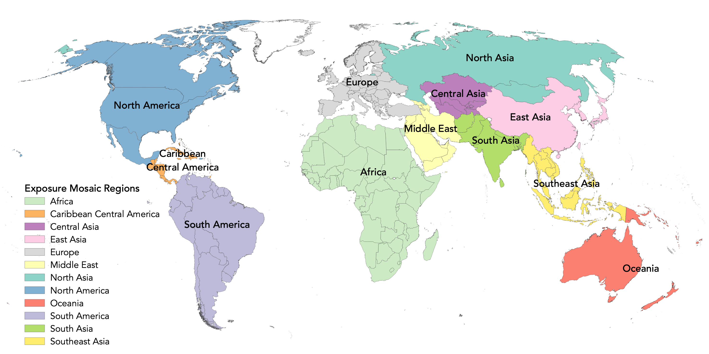

# Global Vulnerability Model

# ✨ Overview

The v2023.1.0 release for the GEM's global vulnerability model is available! 🥳 🚀

This repository hosts the most up-to-date versions of the vulnerability models
for use in GEM's Global Risk Model. A detailed description of the complete workflow and vulnerability results is available [here](https://docs.openquake.org/vulnerability/)

# 🌍 Region and country list

  

The following regions and countries/territories are covered in this repository. 

| REGION                    | COUNTRIES AND TERRITORIES |
|---------------------------|-----------|
| Africa                    | Algeria, Angola, Benin, Botswana, Burkina_Faso, Burundi, Cameroon, Cape_Verde, Central_African_Republic, Chad, Comoros, Congo, Democratic_Republic_of_the_Congo, Djibouti, Egypt, Equatorial_Guinea, Eritrea, Eswatini, Ethiopia, Gabon, Gambia, Ghana, Guinea, Guinea_Bissau, Ivory_Coast, Kenya, Lesotho, Liberia, Libya, Madagascar, Malawi, Mali, Mauritania, Mauritius, Morocco, Mozambique, Namibia, Niger, Nigeria, Rwanda, Sao_Tome_and_Principe, Senegal, Seychelles, Sierra_Leone, Somalia, South_Africa, South_Sudan, Sudan, Tanzania, Togo, Tunisia, Uganda, Zambia, Zimbabwe |
| Caribbean_Central_America | Anguilla, Antigua_and_Barbuda, Aruba, Bahamas, Barbados, Belize, British_Virgin_Islands, Cayman_Islands, Costa_Rica, Cuba, Dominica, Dominican_Republic, El_Salvador, Grenada, Guadeloupe, Guatemala, Haiti, Honduras, Jamaica, Martinique, Montserrat, Nicaragua, Panama, Puerto_Rico, Saint_Kitts_and_Nevis, Saint_Lucia, Saint_Vincent_and_the_Grenadines, Trinidad_and_Tobago, Turks_and_Caicos_Islands, US_Virgin_Islands |
| Central_Asia              | Kazakhstan, Kyrgyzstan, Tajikistan, Turkmenistan, Uzbekistan |
| East_Asia                 | China, Hong_Kong, Japan, Macao, North_Korea, South_Korea, Taiwan |
| Europe                    | Albania, Andorra, Austria, Belarus, Belgium, Bosnia_and_Herzegovina, Bulgaria, Croatia, Cyprus, Czechia, Denmark, Estonia, Finland, France, Germany, Gibraltar, Greece, Hungary, Iceland, Ireland, Isle_of_Man, Italy, Kosovo, Latvia, Liechtenstein, Lithuania, Luxembourg, Malta, Moldova, Monaco, Montenegro, Netherlands, North_Macedonia, Norway, Poland, Portugal, Romania, Serbia, Slovakia, Slovenia, Spain, Sweden, Switzerland, Turkey, Ukraine, United_Kingdom |
| Middle_East               | Afghanistan, Armenia, Azerbaijan, Bahrain, Georgia, Iran, Iraq, Israel, Jordan, Kuwait, Lebanon, Oman, Pakistan, Palestine, Qatar, Saudi_Arabia, Syria, United_Arab_Emirates, Yemen |
| North_America             | Canada, Mexico, United_States_of_America |
| North_Asia                | Mongolia, Russia |
| Oceania                   | American_Samoa, Australia, Cook_Islands, Fiji, Guam, Kiribati, Marshall_Islands, Micronesia, Nauru, New_Caledonia, New_Zealand, Niue, Northern_Mariana_Islands, Palau, Papua_New_Guinea, Samoa, Solomon_Islands, Tonga, Tuvalu, Vanuatu |
| South_America             | Argentina, Bolivia, Brazil, Chile, Colombia, Ecuador, French_Guiana, Guyana, Paraguay, Peru, Suriname, Uruguay, Venezuela |
| South_Asia                | Afghanistan, Bangladesh, Bhutan, India, Nepal, Pakistan, Sri_Lanka |
| Southeast_Asia            | Brunei, Cambodia, Indonesia, Laos, Malaysia, Myanmar, Philippines, Singapore, Thailand, Timor_Leste, Vietnam |

## What can I find in this repository?

Inside each country's directory one can find a total of five files listed below

- taxonomy_mapping_*.csv : This file has the complete list of building classes used in the exposure model and their match in the vulnerability model with the respective weight used by the [OpenQuake-engine](https://github.com/gem/oq-engine). If a specific mapping file exists for the country then that file should be used in calculations, if such file does not exist a regional mapping is provided in the directory.  
- vulnerability_structural.xml : This file contains the vulnerability functions for structural elements used by OpenQuake-engine to compute economic losses.
- vulnerability_nostructural.xml : This file contains the vulnerability functions for non-structural elements (drift and acceleration sensitive elements) used by OpenQuake-engine to compute economic losses.
- vulnerability_contents.xml : This file contains the vulnerability functions for contents used by OpenQuake-engine to compute economic losses.
- vulnerability_fatalities.xml : This file contains the vulnerability functions for occupants used by OpenQuake-engine to compute the number human casualties. 

## How were the models developed?

A complete description of the vulnerability modelling workflow is provided in the [documentation page](https://docs.openquake.org/vulnerability/). The models were developed using the Vulnerability Modellers Toolkit (VMTK) ([Martins et al 2021](https://doi.org/10.1007/s10518-021-01187-w)), a suite of tools developed by scientists working at the Global Earthquake Model Foundation and intended to provide earthquake engineers with a comprehensive platform to develop fragility and vulnerability models. The toolkit is freely accessible through its [github repository](https://github.com/GEMScienceTools/VMTK-Vulnerability-Modellers-ToolKit). A demonstration of the capabilities of the VMTK can be found [here](https://www.globalquakemodel.org/vmtk-webinar-2023)      

## Where can I find additional information on the defined building classes?

The building classes defined within this exposure model follow the [GEM Building Taxonomy v3.2 convention](https://github.com/gem/gem_taxonomy). Please refer to the [GEM Taxonomy Glossary](https://taxonomy.openquake.org/) for additional details on taxonomy substrings.

# Legacy database

The vulnerability models collected by [Yepes-Estrada et al](https://doi.org/10.1193/011816EQS015DP) and previously hosted in the recently deprecated Openquake-platform have been made available to the scientific community though this repository in the [2016_Global_Vulnerability_Database](https://github.com/gem/global_vulnerability_model/tree/8091304b44dd50425863a57e829720cc9f205bcb/_2016_Global_Vulnerability_Database) directory.

The metadata for each capacity curve/damage to loss/fragility/vulnerability model in the 2016_Global_Vulnerability_database is provided through a [json](https://www.json.org/json-en.html) file, whereas the nrml files found in the fragility and vulnerability directories are the input files used by the [OpenQuake-engine](https://github.com/gem/oq-engine).      

# 📚 Publications

Please cite the work as follows:

Martins L., Silva V. (2023), Global Vulnerability Model of the GEM Foundation, GitHub. https://github.com/gem/global_vulnerability_model/

# 🌟 Contributors 

The authors are grateful for the input from dozens of local and international experts. A list of contributors can be found at https://www.globalquakemodel.org/risk-model-contributors.

# License
[![CC BY-NC-SA 4.0][cc-by-nc-sa-shield]][cc-by-nc-sa]

This work is licensed under a
[Creative Commons Attribution-NonCommercial-ShareAlike 4.0 International License][cc-by-nc-sa], which requires:

* Attribution (you must give appropriate credit, provide a link to the license, and indicate if changes were made)
* Non-commercial (you may not use the material for commercial purposes)
* ShareAlike (derivatives created must be made available under the same license as the original)

[![CC BY-NC-SA 4.0][cc-by-nc-sa-image]][cc-by-nc-sa]

[cc-by-nc-sa]: http://creativecommons.org/licenses/by-nc-sa/4.0/
[cc-by-nc-sa-image]: https://licensebuttons.net/l/by-nc-sa/4.0/88x31.png
[cc-by-nc-sa-shield]: https://img.shields.io/badge/License-CC%20BY--NC--SA%204.0-lightgrey.svg

Any deviation from these terms incur in license infringement. For commercial use of the data contained within this work, a specific license agreement must be made tailored to your use case, in such instance please contact GEM at product@globalquakemodel.org

# 🤔 Frequently asked questions 

### Which version am I seeing? How to change the version?
By default you will see the files in the repository in the  `main` branch. Each version of the model that is released can be accessed is marked with a `tag`. By changing the tag version at the top of the repository, you can change see the files for a given version.

Note that the `main` branch could contain the work-in-progress of the next version of the model.

### How do I download the data for a given version?
For each version, a related zip file is available in the [release section](https://github.com/gem/global_vulnerability_model/releases).

### Where can I obtain the fragility functions or obtain vulnerability models for other risk metrics such as business interruption?

Please contact us at product@globalquakemodel.org

### What if my use case does not comply with the Creative Commons license offered?

If your use case deviates from the requirements of the offered license, but still want to explore the use of the data, please contact us at license@globalquakemodel.org 

# References:
Martins, L., Silva, V. Development of a fragility and vulnerability model for global seismic risk analyses. Bull Earthquake Eng 19, 6719–6745 (2021). doi.org/10.1007/s10518-020-00885-1

Martins, L., Silva, V., Crowley, H. et al. Vulnerability modellers toolkit, an open-source platform for vulnerability analysis. Bull Earthquake Eng 19, 5691–5709 (2021). doi.org/10.1007/s10518-021-01187-w
